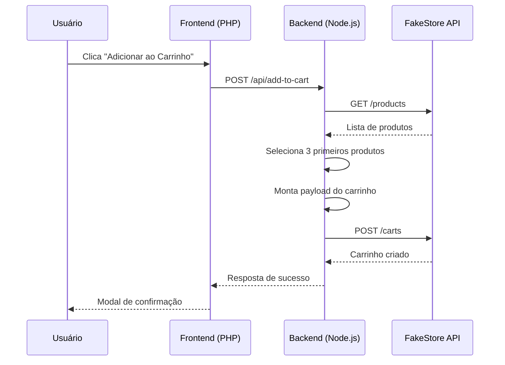
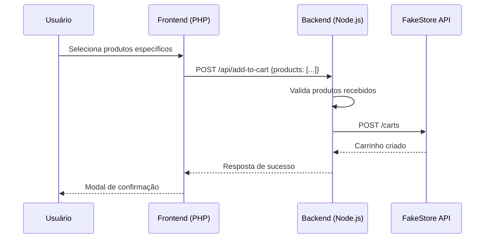

# 🛒 E-commerce FakeStore API Integration

[](https://nodejs.org/)
[](https://php.net/)
[](https://expressjs.com/)
[](LICENSE)

Uma aplicação e-commerce completa que integra com a FakeStore API para simular o processo de adicionar produtos ao carrinho de compras. O projeto utiliza uma arquitetura frontend-backend com PHP para interface e Node.js para processamento de dados.

**Desenvolvido por:** Cauê Sotero  
**Email:** soterocaue2@gmail.com  
**GitHub:** [cauesotero](https://github.com/cauesotero)

## 📋 Índice

- [Arquitetura do Sistema](#arquitetura-do-sistema)
- [Fluxo de Funcionamento](#fluxo-de-funcionamento)
- [Instalação e Configuração](#instalação-e-configuração)
- [Como Executar](#como-executar)
- [Documentação da API](#documentação-da-api)
- [Tratamento de Erros](#tratamento-de-erros)
- [Estrutura do Projeto](#estrutura-do-projeto)
- [Tecnologias Utilizadas](#tecnologias-utilizadas)
- [Contribuição](#contribuição)

## 🏗️ Arquitetura do Sistema

```
┌─────────────────┐    HTTP/JSON    ┌─────────────────┐    REST API    ┌─────────────────┐
│   Frontend      │ ──────────────► │    Backend      │ ──────────────► │  FakeStore API  │
│   (PHP)         │                 │   (Node.js)     │                 │   (Externa)     │
│                 │                 │                 │                 │                 │
│ • Interface     │                 │ • Processamento │                 │ • Produtos      │
│ • Interação     │                 │ • Integração    │                 │ • Carrinhos     │
│ • Validação     │                 │ • Tratamento    │                 │ • Usuários      │
└─────────────────┘                 └─────────────────┘                 └─────────────────┘
```

## 🔄 Fluxo de Funcionamento

### 1. Fluxo Principal - Adicionar ao Carrinho



### 2. Fluxo Alternativo - Produtos Específicos



## 💻 Código e Pseudo-código

### Backend - Processo Principal

```javascript
// Pseudo-código do fluxo principal
async function addToCart(req, res) {
    try {
        // 1. Verificar se produtos foram enviados
        if (req.body.products && req.body.products.length > 0) {
            productsToAdd = req.body.products;
        } else {
            // 2. Buscar produtos da API externa
            const productsResponse = await axios.get('https://fakestoreapi.com/products');
            
            // 3. Selecionar os 3 primeiros produtos
            const firstThreeProducts = productsResponse.data.slice(0, 3);
            productsToAdd = firstThreeProducts.map(product => ({
                productId: product.id,
                quantity: 1
            }));
        }

        // 4. Montar payload do carrinho
        const cartPayload = {
            userId: 1,
            date: getCurrentDate(),
            products: productsToAdd
        };

        // 5. Enviar para API externa
        const cartResponse = await axios.post('https://fakestoreapi.com/carts', cartPayload);

        // 6. Retornar resposta de sucesso
        res.json({
            success: true,
            message: 'Produtos adicionados ao carrinho com sucesso!',
            cartId: cartResponse.data.id,
            products: productsInfo
        });

    } catch (error) {
        // 7. Tratamento de erros
        handleError(error, res);
    }
}
```

### Frontend - Interface de Usuário

```php
// Pseudo-código do frontend
class EcommerceInterface {
    
    function loadProducts() {
        // 1. Fazer requisição para backend
        $response = fetch('/api/products');
        
        // 2. Exibir produtos em grid
        foreach ($products as $product) {
            displayProductCard($product);
        }
        
        // 3. Atualizar estatísticas
        updateStats($products);
    }
    
    function addToCart($selectedProducts) {
        // 1. Validar seleção (máximo 3 produtos)
        if (count($selectedProducts) > 3) {
            showError('Máximo de 3 produtos permitidos');
            return;
        }
        
        // 2. Enviar requisição para backend
        $payload = ['products' => $selectedProducts];
        $response = fetch('/api/add-to-cart', {
            method: 'POST',
            body: json_encode($payload)
        });
        
        // 3. Exibir resultado
        if ($response->success) {
            showSuccessModal($response);
        } else {
            showError($response->message);
        }
    }
}
```

## 🛡️ Tratamento de Erros

### Estratégia de Tratamento

O sistema implementa uma estratégia robusta de tratamento de erros com diferentes níveis:

#### 1. Erros de Conexão
```javascript
if (error.code === 'ECONNREFUSED' || error.code === 'ENOTFOUND') {
    return {
        success: false,
        message: 'Erro de conexão com a API externa',
        errorType: 'CONNECTION_ERROR'
    };
}
```

#### 2. Erros de API Externa
```javascript
if (error.response) {
    return {
        success: false,
        message: `Erro na API: ${error.response.status} - ${error.response.statusText}`,
        errorType: 'API_ERROR',
        details: error.response.data
    };
}
```

#### 3. Erros de Requisição
```javascript
if (error.request) {
    return {
        success: false,
        message: 'Erro na requisição para a API externa',
        errorType: 'REQUEST_ERROR'
    };
}
```

#### 4. Erros Internos
```javascript
return {
    success: false,
    message: 'Erro interno do servidor',
    errorType: 'INTERNAL_ERROR',
            details: error.message
};
```

### O que fazer se a criação da tarefa falhar?

1. **Retry Automático**: Implementar retry com backoff exponencial
2. **Fallback**: Usar dados em cache se disponível
3. **Notificação**: Alertar usuário sobre o problema
4. **Logging**: Registrar erro para análise posterior
5. **Graceful Degradation**: Continuar funcionamento com funcionalidades limitadas

```javascript
// Exemplo de implementação de retry
async function addToCartWithRetry(payload, maxRetries = 3) {
    for (let attempt = 1; attempt <= maxRetries; attempt++) {
        try {
            return await axios.post('https://fakestoreapi.com/carts', payload);
        } catch (error) {
            if (attempt === maxRetries) throw error;
            
            // Backoff exponencial
            const delay = Math.pow(2, attempt) * 1000;
            await new Promise(resolve => setTimeout(resolve, delay));
        }
    }
}
```

## 🚀 Instalação e Configuração

### Pré-requisitos

- **Node.js**: v18.0.0 ou superior
- **PHP**: v7.4 ou superior
- **NPM**: v8.0.0 ou superior
- **Servidor Web**: Apache/Nginx (opcional)

### Versões Testadas

| Componente | Versão | Status |
|------------|--------|--------|
| Node.js | 18.17.0 | ✅ Testado |
| PHP | 8.1.0 | ✅ Testado |
| Express | 4.18.2 | ✅ Testado |
| Axios | 1.6.0 | ✅ Testado |

### 1. Clone o Repositório

```bash
git clone https://github.com/caueeex/fakestore-api-integration.git
cd fakestore-api-integration-main
```

### 2. Configurar Backend

```bash
# Opção A: Usar script de instalação
scripts\install.bat    # Windows
./scripts/install.sh   # Linux/Mac

# Opção B: Instalação manual
cd backend
npm install
npm list
```

### 3. Configurar Frontend

```bash
# Navegar para o diretório do frontend
cd frontend

# Verificar se o PHP está instalado
php --version

# Criar arquivo de configuração (se necessário)
cp config.php.example config.php
```

## ▶️ Como Executar

### Opção 1: Desenvolvimento Local

#### 1. Iniciar Backend

```bash
cd backend
npm start
```

**Output esperado:**
```
🚀 Servidor rodando na porta 3000
📡 Endpoints disponíveis:
   - GET  /api/products
   - POST /api/add-to-cart
   - GET  /api/health
```

#### 2. Configurar Frontend

**Opção A: XAMPP (Recomendado)**
1. **Importante**: Se você baixou o projeto como ZIP, extraia a pasta `fakestore-api-integration-main` para dentro do diretório `htdocs` do XAMPP
2. Inicie o XAMPP Control Panel
3. Clique em "Start" no Apache
4. Acesse: http://localhost/fakestore-api-integration-main/frontend/

**Opção B: Servidor PHP Embutido**
```bash
cd frontend
php -S localhost:8000
```

#### 3. Acessar Aplicação

- **Frontend (XAMPP)**: http://localhost/fakestore-api-integration-main/frontend/
- **Frontend (PHP Server)**: http://localhost:8000
- **Backend API**: http://localhost:3000

### Opção 2: Scripts Automatizados

```bash
# Windows
scripts\start.bat

# Linux/Mac
./scripts/start.sh
```

### Opção 3: Docker (Futuro)

```bash
# Em desenvolvimento
docker-compose up -d
```

## 📡 Documentação da API

### Endpoints do Backend

#### GET `/api/products`
Busca todos os produtos da FakeStore API.

**Resposta de Sucesso:**
```json
{
  "success": true,
  "message": "Produtos obtidos com sucesso!",
  "products": [
    {
      "id": 1,
      "title": "Fjallraven - Foldsack No. 1 Backpack",
      "price": 109.95,
      "description": "Your perfect pack for everyday use...",
      "category": "men's clothing",
      "image": "https://fakestoreapi.com/img/81fPKd-2AYL._AC_SL1500_.jpg",
      "rating": {
        "rate": 3.9,
        "count": 120
      }
    }
  ],
  "total": 20
}
```

#### POST `/api/add-to-cart`
Adiciona produtos ao carrinho.

**Request Body (Opcional):**
```json
{
  "products": [
    {"id": 1, "quantity": 1},
    {"id": 2, "quantity": 1}
  ]
}
```

**Resposta de Sucesso:**
```json
{
  "success": true,
  "message": "Produtos adicionados ao carrinho com sucesso!",
  "cartId": 1,
  "products": [
    {
      "id": 1,
      "title": "Fjallraven - Foldsack No. 1 Backpack",
      "price": 109.95
    }
  ],
  "cartData": {
    "id": 1,
    "userId": 1,
    "date": "2025-01-08",
    "products": [
      {"productId": 1, "quantity": 1}
    ]
  }
}
```

#### GET `/api/health`
Verifica o status do servidor.

**Resposta:**
```json
{
  "status": "ok",
  "timestamp": "2025-01-08T10:30:00.000Z",
  "uptime": 3600
}
```

### Códigos de Status HTTP

| Código | Descrição |
|--------|-----------|
| 200 | Sucesso |
| 400 | Requisição inválida |
| 500 | Erro interno do servidor |

## 📁 Estrutura do Projeto

```
fakestore-api-integration-main/
├── backend/
│   ├── package.json          # Dependências Node.js
│   ├── server.js             # Servidor Express
│   └── node_modules/         # Dependências instaladas
├── frontend/
│   ├── index.php             # Interface principal
│   ├── config.php            # Configurações
│   └── css/
│       └── style.css         # Estilos CSS
├── scripts/
│   ├── start.bat             # Iniciar aplicação (Windows)
│   ├── start.sh              # Iniciar aplicação (Linux/Mac)
│   ├── install.bat           # Instalar dependências (Windows)
│   ├── install.sh            # Instalar dependências (Linux/Mac)
│   ├── stop.bat              # Parar serviços (Windows)
│   ├── stop.sh               # Parar serviços (Linux/Mac)
│   ├── test.bat              # Executar testes (Windows)
│   ├── test.sh               # Executar testes (Linux/Mac)
│   └── README.md             # Documentação dos scripts
├── README.md                 # Este arquivo
├── TESTING.md                # Guia de testes
└── .gitignore               # Arquivos ignorados pelo Git
```

## 🛠️ Tecnologias Utilizadas

### Backend
- **Node.js**: Runtime JavaScript
- **Express.js**: Framework web
- **Axios**: Cliente HTTP
- **CORS**: Middleware para CORS

### Frontend
- **PHP**: Linguagem de programação
- **HTML5**: Estrutura da página
- **CSS3**: Estilização
- **JavaScript**: Interatividade
- **Font Awesome**: Ícones
- **Lucide Icons**: Ícones SVG

### APIs Externas
- **FakeStore API**: API de produtos e carrinhos

## 🧪 Testes

### Testes Manuais

1. **Teste de Conexão**
   ```bash
   curl http://localhost:3000/api/health
   ```

2. **Teste de Produtos**
   ```bash
   curl http://localhost:3000/api/products
   ```

3. **Teste de Carrinho**
   ```bash
   curl -X POST http://localhost:3000/api/add-to-cart \
     -H "Content-Type: application/json"
   ```

### Testes Automatizados (Futuro)

```bash
# Instalar dependências de teste
npm install --save-dev jest supertest

# Executar testes
npm test
```

## 🔧 Configuração Avançada


### Logs

O sistema gera logs detalhados:

```bash
# Logs de desenvolvimento
npm run dev

# Logs de produção
npm start
```

## 🤝 Contribuição

1. Fork o projeto
2. Crie uma branch para sua feature (`git checkout -b feature/AmazingFeature`)
3. Commit suas mudanças (`git commit -m 'Add some AmazingFeature'`)
4. Push para a branch (`git push origin feature/AmazingFeature`)
5. Abra um Pull Request

## 📄 Licença

Este projeto está sob a licença MIT. Veja o arquivo [LICENSE](LICENSE) para mais detalhes.

## 👥 Autores

- **Cauê Sotero** - *Desenvolvimento inicial* - [GitHub](https://github.com/cauesotero)

## 🙏 Agradecimentos

- [FakeStore API](https://fakestoreapi.com/) por fornecer a API de teste
- [Font Awesome](https://fontawesome.com/) pelos ícones
- [Express.js](https://expressjs.com/) pelo framework web

## 📞 Suporte

Para suporte, envie um email para soterocaue2@gmail.com ou abra uma issue no GitHub.

---

**⭐ Se este projeto te ajudou, considere dar uma estrela no repositório!** 
